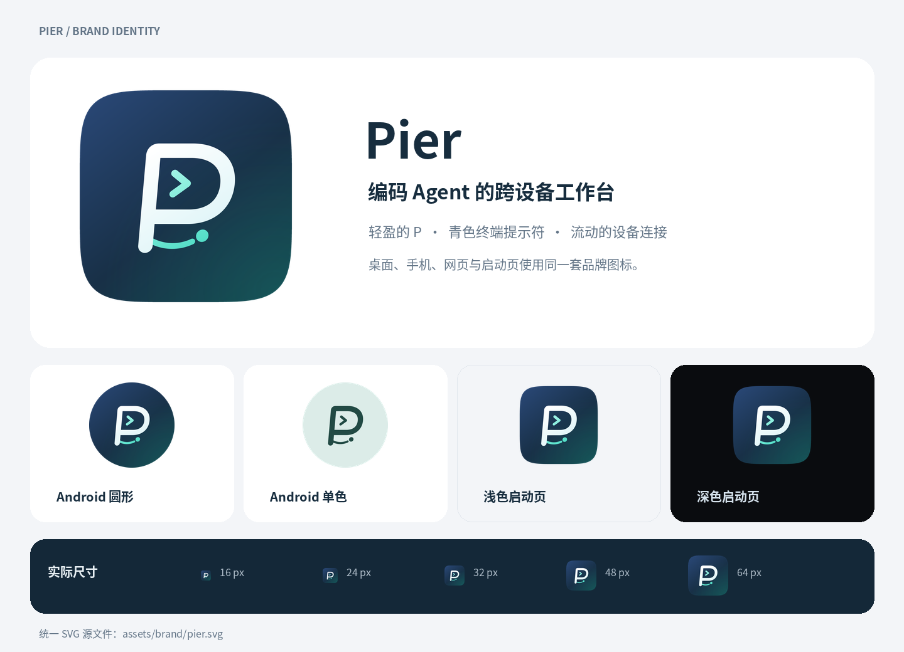

# Pier 图标

统一的矢量源文件为 `assets/brand/pier.svg`。白色线条 P 保留内部留白，青色 `>` 对应编码 Agent 与终端，底部上扬的弧线与轻巧节点对应跨设备连接。标志整体向前倾斜 5°，蓝青渐变背景与明亮的提示符增加轻盈感；标志也能独立用于单色图标。



SVG 的 `background` 和 `mark` 分组分别用于 Android 自适应图标的背景与前景。生成前景时，在保留原始倾斜变换的基础上整体缩放到 90%，使所有笔画保持在 Android 的中央 66/108 圆形安全区域内，适配圆形、圆角矩形等系统蒙版。iOS 使用不带透明通道的满版图，桌面图标沿用 1024px 画布、824px 连续圆角主体与 100px 留白。桌面界面使用 SVG，浏览器 favicon、手机启动页和 Android 主题图标从同一源文件生成。

修改 SVG 后，在仓库根目录重新生成图片（Python 依赖 Pillow 与 CairoSVG，可通过 uv 临时提供；系统需安装 Cairo 运行库）：

```bash
uv run --with pillow --with cairosvg python apps/desktop/scripts/make-app-icon.py
cd apps/desktop
bun run tauri icon src-tauri/app-icon.png --output src-tauri/icons
```

Tauri CLI 还会生成 `icons/android` 与 `icons/ios`；手机端由 Expo 使用 `apps/mobile/assets` 中的图片，因此这两个生成目录不需要提交。修改完成后检查 16px / 32px 的可读性、浅深背景，以及 Android 圆形与圆角方形裁切。
